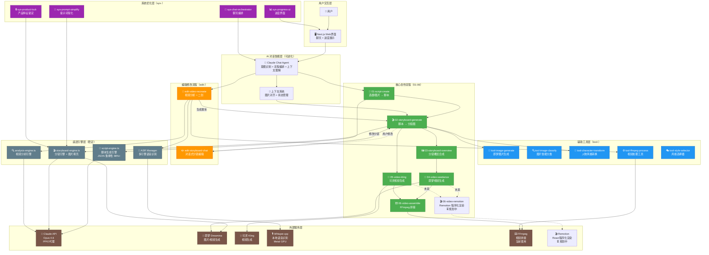
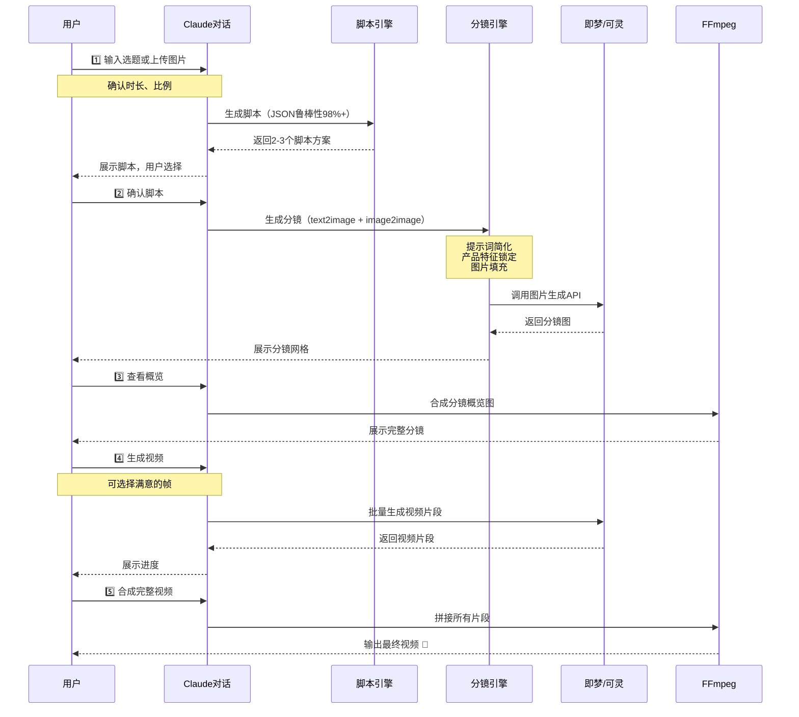
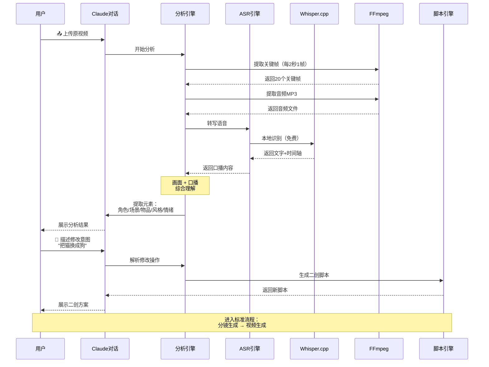
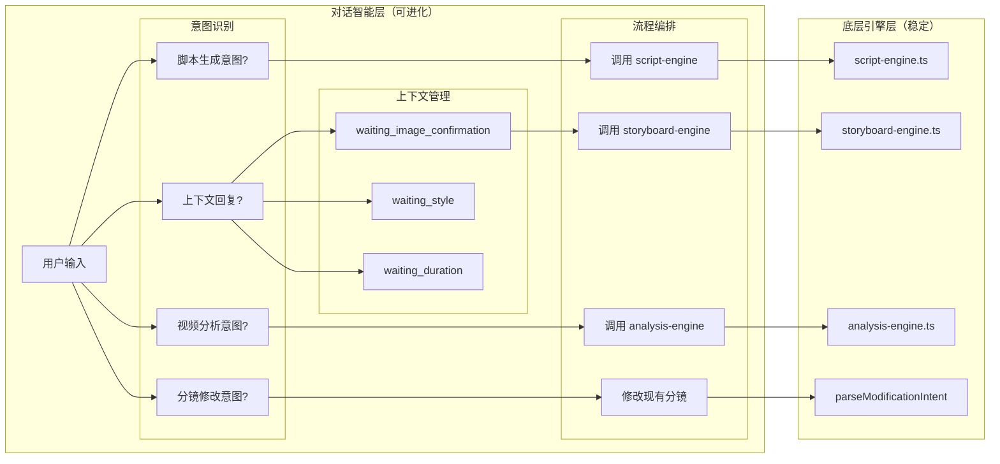
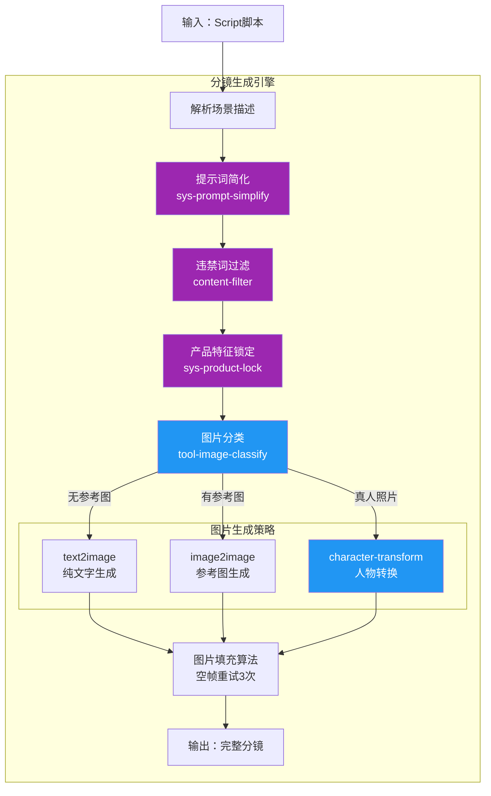
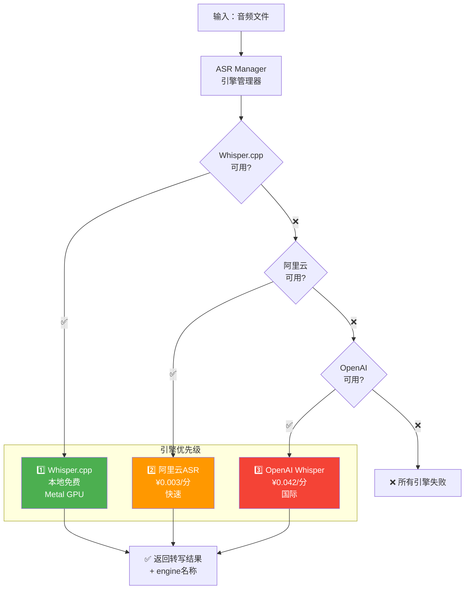
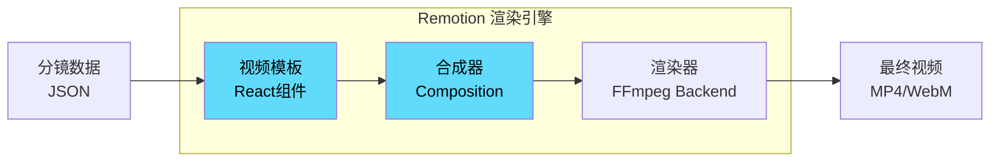

# 超级视频Agent - 产品架构全景图

## 📊 整体架构图



---

## 🎯 核心创作流程详解



---

## 🔄 视频二创流程详解



---

## 🧠 AI 对话智能层架构



---

## 🎨 分镜生成引擎详解



---

## 🎤 ASR 多引擎系统



---

## 📦 技术栈总览

### 前端层
- **框架**: Next.js 15 (App Router)
- **样式**: Tailwind CSS
- **状态**: React Hooks + Context
- **流式**: Server-Sent Events (SSE)

### AI 能力层
- **大模型**: Claude Opus 4.6 (via PPIO)
- **图片生成**: 即梦 Dreamina
- **视频生成**: 可灵 Kling + 即梦 Seedance
- **语音识别**: Whisper.cpp (Metal GPU)

### 后端引擎层
- **脚本引擎**: script-engine.ts (JSON鲁棒性98%+)
- **分镜引擎**: storyboard-engine.ts
- **分析引擎**: analysis-engine.ts (画面+口播)
- **ASR引擎**: ASR Manager (多引擎降级)

### 工具链
- **视频处理**: FFmpeg
- **数据库**: Prisma + LibSQL (Turso)
- **文件存储**: 本地 public/uploads

---

## 🎯 设计原则

### 1. 分层架构
```
用户交互层（UI）
     ↓
AI对话智能层（可进化）← 可通过对话调整
     ↓
底层引擎层（稳定）← 标准化API保护
     ↓
外部服务层（第三方）
```

### 2. 智能进化 vs 能力保护
- **对话层**：灵活进化，可通过对话改变逻辑
- **引擎层**：标准化接口，保护核心能力

### 3. 上下文理解
- 记住对话历史
- 理解用户回答是在回应之前的问题
- 图片上传先对齐理解再执行

### 4. 容错设计
- JSON 生成：9步修复策略，成功率98%+
- ASR识别：多引擎自动降级
- 分镜生成：空帧重试3次

---

## 🎬 Remotion 程序化视频渲染（规划中）

### 什么是 Remotion？

Remotion 是一个用 **React + TypeScript** 编写视频的框架，将视频渲染变成编程任务。

```typescript
// 示例：用 React 组件描述视频
<Sequence from={0} durationInFrames={90}>
  <FadeIn>
    
    <AbsoluteFill>
      <h1>{script.title}</h1>
    </AbsoluteFill>
  </FadeIn>
</Sequence>
```

### 为什么需要 Remotion？

#### 当前方案（FFmpeg）的局限：
- ❌ 简单拼接，无法精细控制
- ❌ 特效需要复杂的 filter 参数
- ❌ 文字叠加、转场效果编写困难
- ❌ 无法预览，调试周期长

#### Remotion 的优势：
- ✅ **React组件化**：每个镜头是一个组件，可复用
- ✅ **精确控制**：帧级别的动画控制
- ✅ **丰富特效**：淡入淡出、缩放、平移、3D变换
- ✅ **文字动画**：TypewriterEffect、FadeIn、SlideUp
- ✅ **实时预览**：浏览器中实时查看效果
- ✅ **类型安全**：TypeScript全程类型检查
- ✅ **高质量输出**：支持4K、60fps渲染

### 技术架构图



### 实现方案

#### 1. 视频模板组件
```typescript
// src/lib/video/remotion/VideoTemplate.tsx
export const VideoTemplate: React.FC<{
  storyboard: Storyboard
  style: VideoStyle
}> = ({ storyboard, style }) => {
  return (
    <AbsoluteFill style={{ backgroundColor: '#000' }}>
      {storyboard.frames.map((frame, i) => (
        <Sequence
          key={i}
          from={i * fps * frame.duration}
          durationInFrames={fps * frame.duration}
        >
          <Frame frame={frame} style={style} />
        </Sequence>
      ))}
    </AbsoluteFill>
  )
}
```

#### 2. 镜头组件
```typescript
// 单个镜头的渲染
const Frame: React.FC<{ frame: Frame; style: VideoStyle }> = ({ frame, style }) => {
  const frame = useCurrentFrame()
  const opacity = interpolate(frame, [0, 30], [0, 1]) // 淡入
  
  return (
    <AbsoluteFill style={{ opacity }}>
      
      {frame.cameraMove === 'zoom-in' && (
        <ZoomEffect from={1} to={1.2} />
      )}
      {frame.text && <TextOverlay text={frame.text} />}
    </AbsoluteFill>
  )
}
```

#### 3. 渲染接口
```typescript
// src/lib/video/remotion-renderer.ts
export async function renderVideo(storyboard: Storyboard) {
  const composition = await registerComposition({
    id: 'video-template',
    component: VideoTemplate,
    durationInFrames: calculateTotalFrames(storyboard),
    fps: 30,
    width: 1920,
    height: 1080,
  })
  
  const output = await renderMedia({
    composition,
    codec: 'h264',
    outputLocation: `public/outputs/${storyboard.id}.mp4`,
  })
  
  return output
}
```

### 对比：FFmpeg vs Remotion

| 维度 | FFmpeg（当前） | Remotion（未来） |
|------|----------------|------------------|
| **实现方式** | Shell命令拼接 | React组件编程 |
| **学习曲线** | 陡峭（filter语法） | 平缓（React开发者友好） |
| **预览效果** | 无法预览 | 浏览器实时预览 |
| **特效丰富度** | 有限 | 丰富（CSS/Canvas/WebGL） |
| **代码可维护性** | 低 | 高（组件化） |
| **调试难度** | 困难 | 简单（浏览器DevTools） |
| **性能** | 极快 | 较慢（但可分布式） |
| **成熟度** | 极高 | 中等 |

### 使用场景

#### FFmpeg 适用场景（保留）：
- ✅ 简单视频拼接
- ✅ 格式转换、压缩
- ✅ 音频提取、合成
- ✅ 快速处理大量视频

#### Remotion 适用场景（新增）：
- ✅ 精美片头/片尾
- ✅ 文字动画、字幕
- ✅ 复杂转场效果
- ✅ 数据可视化视频
- ✅ 模板化批量生成

### 集成路线图

#### Phase 1: 基础集成（2周）
- [ ] 安装 Remotion 依赖
- [ ] 创建基础视频模板
- [ ] 实现简单的镜头拼接
- [ ] 添加淡入淡出转场

#### Phase 2: 特效增强（4周）
- [ ] 实现 10+ 转场特效
- [ ] 添加文字动画系统
- [ ] 支持缩放、平移、旋转
- [ ] 音频同步

#### Phase 3: 模板系统（6周）
- [ ] 多风格视频模板
- [ ] 用户自定义模板
- [ ] 模板市场

#### Phase 4: 性能优化（8周）
- [ ] 服务端渲染
- [ ] 分布式渲染
- [ ] 渲染缓存

### 技术挑战

1. **渲染性能**：Remotion比FFmpeg慢，需要优化
2. **服务器部署**：需要无头浏览器环境（Puppeteer）
3. **成本控制**：渲染资源消耗较大
4. **兼容性**：需要与现有FFmpeg方案共存

### 预期收益

- 📈 **用户满意度** +30%（更丰富的视频效果）
- ⚡ **开发效率** +50%（组件化开发）
- 🎨 **视频质量** +40%（专业级特效）
- 🔧 **可维护性** +60%（代码结构清晰）

---

## 📈 关键指标

| 指标 | 当前状态 | 目标 |
|------|----------|------|
| JSON生成成功率 | 98%+ | 99%+ |
| 分镜生成成功率 | 95%+ | 98%+ |
| ASR识别准确率 | 95%+ | 97%+ |
| 视频生成成功率 | 90%+ | 95%+ |
| 端到端完成率 | 85%+ | 90%+ |

---

## 🚀 迭代方向

### 短期（1-2周）
1. 完善阿里云ASR引擎
2. 优化分镜生成速度
3. 添加ASR结果缓存
4. 实测完整视频二创流程

### 中期（1-2月）
1. 多模型路由（根据风格自动选择生成模型）
2. 角色一致性系统（IP角色保持一致）
3. 音频同步（歌词/节拍驱动分镜）
4. 异步任务队列（BullMQ）

### 长期（3-6月）
1. Remotion程序化视频渲染
2. 批量视频处理
3. 视频质量自动评分
4. GPU加速优化

---

**此架构图将作为项目的北极星，指导所有后续开发决策。**
